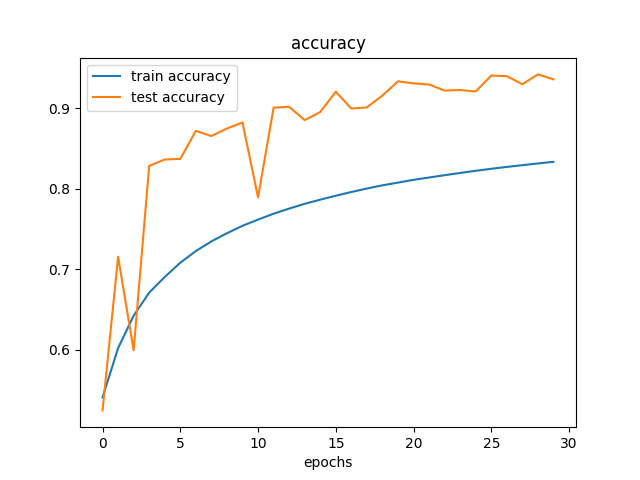
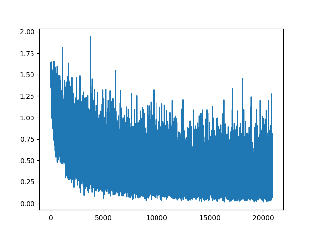
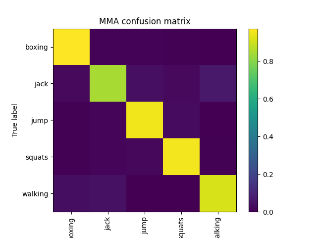

# RadarPCs-PointTransformer
These are PCs files 
for 1024 points:
boxing:757
jump:621
jack:586
squats:624
walk:824

The following figures are the results from the modified network architecture: 
Input data : each sample contains 256 points(1/4 of original data) so the number of samples is increased to 4 times.
Point Transformer:  two transformer blocks are removed, only two blocks left.

The loss over each batch 

